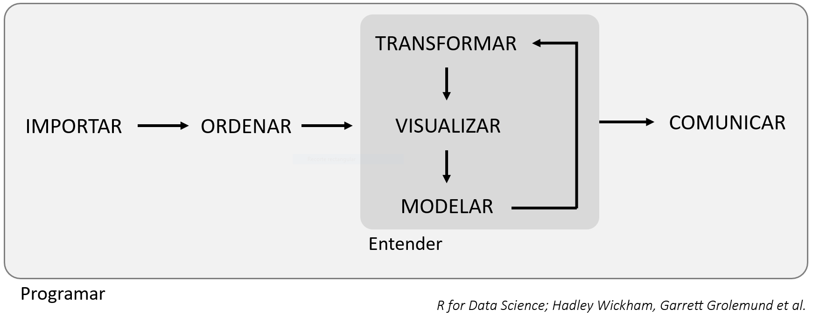

# Introducción a Tidyverse

Uno de los principales problemas que va a encontrarse el bioquímico en su ámbito laboral empieza a la hora de abordar enormes cantidades de datos obtenidos tras un análisis o captura de datos. A partir de estos datos sin procesar, muy difícilmente se puede asimilar cuál ha sido el resultado de este estudio, ya ni hablemos de llegar a cualquier tipo de conclusión.

Para poder utilizar estos datos, es necesario _digerirlos_, es decir, debemos ordenarlos, organizarlos, realizar las transformaciones necesarias y representarlos de alguna manera, de forma que seamos capaces de interpretarlos. La disciplina encargada de transformar estos datos "crudos" indescifrables en conocimiento aplicable se denomina **ciencia de datos**, con la que se es capaz de generar muchas posibles hipótesis que explorar en profundidad.

Existen numerosas herramientas informáticas (tales como software, paquetes de funciones, etc.) a disposición del investigador para llevar a cabo esta tarea. En un principio, para un bioquímico con poca experiencia en el análisis informático de datos, es complicado saber por cuál de estas herramientas empezar. La ciencia de datos es una disciplina extensísima, y no existe una sola forma "correcta" de entrar en este mundo. En este tutorial vamos a introducir al alumno en esta materia con **Tidyverse**.

## ¿Qué es Tidyverse?


Tidyverse es una **colección de paquetes de R**, de código abierto, diseñados para su **aplicación en la ciencia de datos**. Estos paquetes y sus funciones son los mostrados a continuación:

| PAQUETE     | DESCRIPCIÓN                                         |
| ----------- | --------------------------------------------------- |
| _readr_     |Facilita la importación de datos                     |
| _tibble_    |Crea variaciones de los _data frames_ estándar de R  |
| _tidyr_     |Contiene funciones para el reordenamiento de datos   |
| _dplyr_     |Contiene funciones para modificar _data frames_      |
| _purrr_     |Programación funcional de datos                      |
| _ggplot2_   |Visualización de datos                               |

Veremos la función de cada uno de estos paquetes en profundidad a lo largo de este tutorial. 

## El flujo de trabajo en la ciencia de datos

El flujo de trabajo normal durante el manejo de datos puede seguir el siguiente esquema:



- En primer lugar, debes **importar** tus datos a R.
- Una vez dentro, debes **ordenarlos** de forma consistente (suele ser una buena referencia inicial tener **una variable por columna** y **una observación por fila**), permitiéndote empezar a encontrar relaciones.

Los datos ordenados todavía no muestran fácilmente toda la información que contienen. Primero es necesario **entender** su contexto. Para ello, debemos seguir un proceso de transformación, visualización y modelado.

- **Transformar** permite centrarnos en nuestras variables de interés y crear otras nuevas.

- **Visualizar** significa "ver" los resultados de forma más clara y natural, pudiendo encontrar respuestas a nuestras preguntas o resultados inesperados que nos hagan formular nuevas cuestiones.

- **Modelar** es buscar una interpretación matemática o computacional que expliquen los resultados obtenidos, de forma que podamos obtener nuevas referencias y suposiciones, de forma que podamos retomar los datos desde otra perspectiva y resolver el problema.

Finalmente, tras obtener los resultados finales, **comunicamos** los resultados. Además, rodeando todos estos procesos encontramos la **programación**, que es la herramienta que empleamos durante todo el proyecto.

## Requisitos previos

Para empezar a utilizar Tidyverse, es necesario tener instalado R y RStudio (puedes encontrar ayuda sobre cómo instalar y manejar RStudio clickando [aquí](https://ucodemy.github.io/rbioq/#introduccion-a-r)).

Una vez instalados, ejecutamos el siguiente comando en la consola de RStudio:

```r
install.packages("tidyverse")
```

Ahora tendremos el paquete instalado y listo para usar. Para activarlo, ejecutamos el comando a continuación:

```r
library("tidyverse")
```

Tras esto, Tidyverse está listo para usarse. Es importante ejecutar este último comando al inicio de una nueva sesión.

!!! cite "Referencias"
    - [***Tidyverse; R packages for data science***; Hadley Wickham, Garrett Grolemund et al.](https://www.tidyverse.org/help/)
    - [***R for Data Science***; Hadley Wickham, Garrett Grolemund et al.](https://r4ds.had.co.nz/)


