## Visualización de datos

### Introducción

Es innegable que la ciencias de datos, sobre todo para los recién llegados, puede resultar un poco tediosa. Podemos deducir del [esquema del apartado anterior](http://127.0.0.1:8000/tidyverse/#el-flujo-de-trabajo-en-la-ciencia-de-datos) que, a la hora de entrar en la ciencia de datos, lo mejor es empezar por el principio, es decir, importar, ordenar y transformar los datos.

Sin embargo, esta tarea puede ser muy aburrida y frustrante. Tidyverse, por tanto, propone comenzar el estudio de esta disciplina por la parte de **visualización de datos** que ya han sido ordenados y transformados, tarea mucho más amigable para los nuevos.

El paquete de Tidyverse encargado de la generación de gráficas es **_ggplot2_**. Abrimos RStudio y activamos la librería:

```r
library(tidyverse)
```

En la consola veremos el siguiente mensaje:

```
#> ── Attaching packages ─────────────────────────────────────── tidyverse 1.3.0 ──
#> ✔ ggplot2 3.3.2     ✔ purrr   0.3.4
#> ✔ tibble  3.0.3     ✔ dplyr   1.0.2
#> ✔ tidyr   1.1.2     ✔ stringr 1.4.0
#> ✔ readr   1.4.0     ✔ forcats 0.5.0
#> ── Conflicts ────────────────────────────────────────── tidyverse_conflicts() ──
#> ✖ dplyr::filter() masks stats::filter()
#> ✖ dplyr::lag()    masks stats::lag()
```

_ggplot2_ está activo y listo para usarse. Activaremos Tidyverse cada vez que iniciemos una nueva sesión en RStudio. Podemos ver, además, como hay algunos paquetes en conflicto con otras funciones de R base, pero eso no importa demasiado por ahora.

Comencemos a graficar con _ggplot2_. Como todavía no sabemos importar nuestros propios datos a Tidyverse, vamos a usar una serie de conjuntos de datos incluidos de serie en este paquete, con los que podemos practicar. Podemos ver uno de ellos con el comando  ```mpg```:

```
> mpg
# A tibble: 234 x 11
   manufacturer model      displ  year   cyl trans      drv     cty   hwy fl    class  
   <chr>        <chr>      <dbl> <int> <int> <chr>      <chr> <int> <int> <chr> <chr>  
 1 audi         a4           1.8  1999     4 auto(l5)   f        18    29 p     compact
 2 audi         a4           1.8  1999     4 manual(m5) f        21    29 p     compact
 3 audi         a4           2    2008     4 manual(m6) f        20    31 p     compact
 4 audi         a4           2    2008     4 auto(av)   f        21    30 p     compact
 5 audi         a4           2.8  1999     6 auto(l5)   f        16    26 p     compact
 6 audi         a4           2.8  1999     6 manual(m5) f        18    26 p     compact
 7 audi         a4           3.1  2008     6 auto(av)   f        18    27 p     compact
 8 audi         a4 quattro   1.8  1999     4 manual(m5) 4        18    26 p     compact
 9 audi         a4 quattro   1.8  1999     4 auto(l5)   4        16    25 p     compact
10 audi         a4 quattro   2    2008     4 manual(m6) 4        20    28 p     compact
# ... with 224 more rows

```

!!! example "Razona:"
    ¿Cómo podrías mostrar las 20 primeras filas de este conjunto?
    ??? help "1ª Pista"
        Tienes que utilizar ```print()```. Puedes averiguar como usarlo escribiendo el comando ```?print```.
    ??? help "2ª Pista"
        Utiliza el argumento ```n = <NÚMERO>``` dentro del comando anterior.
    ??? check "Respuesta"
        Empleamos el siguiente comando:
        ```r
        > print(mpg, n = 20)
        ```
        ```
        # A tibble: 234 x 11
          manufacturer model              displ  year   cyl trans      drv     cty   hwy fl    class  
          <chr>        <chr>              <dbl> <int> <int> <chr>      <chr> <int> <int> <chr> <chr>  
        1 audi         a4                   1.8  1999     4 auto(l5)   f        18    29 p     compact
        2 audi         a4                   1.8  1999     4 manual(m5) f        21    29 p     compact
        3 audi         a4                   2    2008     4 manual(m6) f        20    31 p     compact
        4 audi         a4                   2    2008     4 auto(av)   f        21    30 p     compact
        5 audi         a4                   2.8  1999     6 auto(l5)   f        16    26 p     compact
        6 audi         a4                   2.8  1999     6 manual(m5) f        18    26 p     compact
        7 audi         a4                   3.1  2008     6 auto(av)   f        18    27 p     compact
        8 audi         a4 quattro           1.8  1999     4 manual(m5) 4        18    26 p     compact
        9 audi         a4 quattro           1.8  1999     4 auto(l5)   4        16    25 p     compact
        10 audi         a4 quattro           2    2008     4 manual(m6) 4        20    28 p     compact
        11 audi         a4 quattro           2    2008     4 auto(s6)   4        19    27 p     compact
        12 audi         a4 quattro           2.8  1999     6 auto(l5)   4        15    25 p     compact
        13 audi         a4 quattro           2.8  1999     6 manual(m5) 4        17    25 p     compact
        14 audi         a4 quattro           3.1  2008     6 auto(s6)   4        17    25 p     compact
        15 audi         a4 quattro           3.1  2008     6 manual(m6) 4        15    25 p     compact
        16 audi         a6 quattro           2.8  1999     6 auto(l5)   4        15    24 p     midsize
        17 audi         a6 quattro           3.1  2008     6 auto(s6)   4        17    25 p     midsize
        18 audi         a6 quattro           4.2  2008     8 auto(s6)   4        16    23 p     midsize
        19 chevrolet    c1500 suburban 2wd   5.3  2008     8 auto(l4)   r        14    20 r     suv    
        20 chevrolet    c1500 suburban 2wd   5.3  2008     8 auto(l4)   r        11    15 e     suv    
        # ... with 214 more rows
        ```

***mpg*** es un conjunto de datos que reúne información sobre el consumo de combustible de diferentes vehículos, cuyas variables son las siguientes:

| VARIABLE        | DESCRIPCIÓN                                         |
|-----------------|-----------------------------------------------------|
| _manufacturer_  |Nombre de la empresa fabricante                      |
| _model_         |Modelo específico del vehículo                       |
| _displ_         |Cilindrada (en litros)                               |
| _year_          |Año de fabricación                                   |
| _cyl_           |Número de cilindros                                  |
| _trans_         |Tipo de transmisión (manual o automática)            |
| _drv_           |Tipo de tren de transmisión (frontal, trasera o 4x4) |
| _cty_           |Gasto en ciudad (millas por galón)                   |
| _hwy_           |Gasto en carretera (millas por galón)                |
| _fl_            |Tipo de combustible                                  |
| _class_         |Tipo de coche                                        |

Conociendo qué representa cada variable, podemos empezar a representarla gráficamente de forma lógica. El esquema que vamos a seguir para ello es el siguiente:

```r
ggplot(data = <DATOS>) + 
  <FUNCIÓN_GEOM>(mapping = aes(<VARIABLES>))
```

Empezamos con la función ```ggplot()```, que crea el sistema de coordenadas en el que se representan los datos. Dentro de esta función debemos incluir el conjunto de datos al que pertenecen las variables que queremos representar (en este caso, ```data = mpg```).

!!! warning "Impotante:"
    En _ggplot2_, para continuar con el comando en la siguente linea, es necesario colocar un símbolo "+" al final de la anterior.

Como todavía no hemos elegido las variables, la gráfica sigue en blanco. Para seleccionarlas, primero debemos elegir el tipo de gráfico que queremos crear, dependiendo este del tipo de variable que queramos representar (si son continuas o discontinuas). Los diferentes tipos de gráficos los iremos viendo conforme avanzamos en el tutorial. Algunos de estos son:

| TIPO DE GRÁFICA   | DESCRIPCIÓN                                         |
|-------------------|-----------------------------------------------------|
| ```geom_point```  |Diagrama de dispersión                               |
| ```geom_smooth``` |Gráfico de linea suavizada                           |
| ```geom_bar```    |Diagrama de barras (proporcional)                    |
| ```geom_col```    |Diagrama de barras (valores totales)                 |
| ```geom_boxplot```|Diagrama de cajas                                    |

Por ahora, vamos a utilizar ```geom_point```, que genera un diagrama de dispersión.

Finalmente, tenemos que elegir qué vamos a mostrar. Para ello, debemos emplear la función ```mapping```, que define las variables a representar. Esta debe ir acompañada del argumento ```aes()```, junto con ```x``` e ```y``` (en nuestro caso, ```x = displ``` e ```y = hwy```).

Veamos cómo quedaría este ejemplo. 

```r
ggplot(data = mpg) + 
  geom_point(mapping = aes(x = displ, y = hwy))
```

Obtenemos una gráfica como esta:

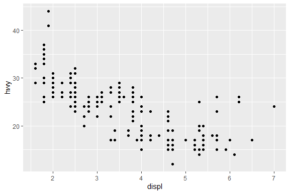

!!! example "Razona:"
    Prueba a hacer lo mismo, pero representando el gasto en carretera vs. el gasto en ciudad. ¿Qué observas?
    ??? check "Respuesta"
    
        ```r
        ggplot(data = mpg) + 
          geom_point(mapping = aes(x = hwy, y = cty))
        ```
        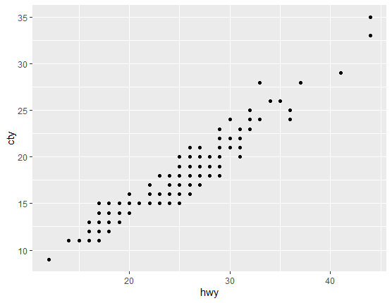
        
        El gasto de combustible, tanto en carretera como en ciudad, sigue una clara tendencia lineal.

### _Aesthetics_

El comando ```aes()```, además de para introducir las variables principales (x e y), sirve para introducir otras variables y modificar de qué forma se van a ver en la gráfica. Ilustrándonos con el ejemplo anterior, podemos ver cómo la gráfica nos muestra la relación que existe entre el consumo de un determinado vehículo y su cilindrada. Si quisiéramos observar la relación que tienen estos resultados con la variable _class_ (el tipo de coche), podemos introducirla dentro del comando ```aes()``` como propiedad visual.

Representamos la clase de coche dentro de la gráfica anterior cambiando el color de los puntos de la siguiente forma:

```r
ggplot(data = mpg) + 
  geom_point(mapping = aes(x = displ, y = hwy, color = class))
```

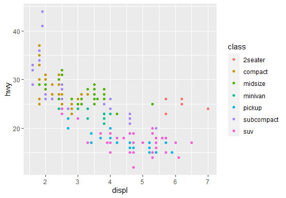

Como vemos, además de representar el gasto en carretera con respecto a la cilindrada, vemos con cada color cada tipo de coche que hay, revelando información extra. 

!!! example "Razona:"
    Observando el ejemplo anterior, ¿a qué conclusion puedes llegar en relación al  tipo de vehículo, su gasto en carretera y su cilindrada?
    ??? check "Respuesta:"
        Los coches, por norma general, gastan más en carretera conforme aumenta su cilindrada. Sin embargo, en este ejemplo existe un grupo de coches que no sigue esta suposición. Al observar la variable que determina el tipo de coche en la gráfica, vemos como estos vehículos son de dos asientos, que, al pesar menos, gastan menos combustible que los demás, independientemente del tamaño del motor.

Podemos mapear cualquier variable dentro del gráfico incluyéndola en ```aes()```. Además, podemos elegir que propiedad visual asignar a esta (color, tamaño de los puntos...). Podemos representar el tipo de vehiculos cambiando el tamaño de los puntos (con ```size```):

```r
ggplot(data = mpg) + 
  geom_point(mapping = aes(x = displ, y = hwy, size = class))
```

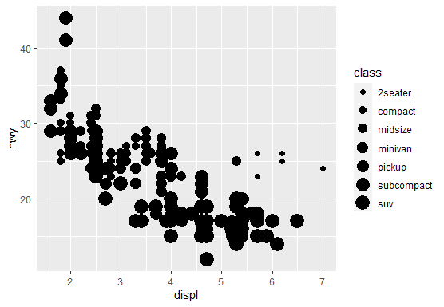

Tambien podemos cambiar su transparencia (con ```alpha```):

```r
ggplot(data = mpg) + 
  geom_point(mapping = aes(x = displ, y = hwy, alpha = class))
```

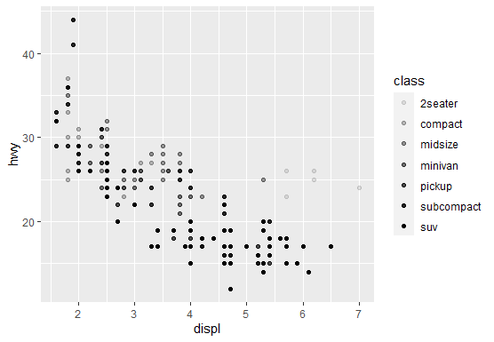

E incluso la forma de los puntos (con ```shape```):

```r
ggplot(data = mpg) + 
  geom_point(mapping = aes(x = displ, y = hwy, shape = class))
```

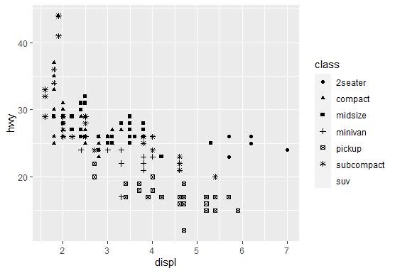

Estos ejemplos, sin embargo, muestran una serie de problemas. En los dos primeros se dificulta la visión de algunos puntos, mientras que en el tercero _ggplot2_ únicamente representa seis formas de puntos, que son fácilmente diferenciables entre sí. Cuando el número de valores es mayor a seis, se dejan de representar algunas de estos.

Estos _aesthetics_, por tanto, solo se emplean en casos muy específicos.

!!! example "Razona:"
    Sobre los ejemplos anteriores, ¿cómo podrías diseñar otras gráficas empleando diferentes _aesthetics_?
    ??? help "Pista:"
        Puedes mirar todos los _aesthetics_ posibles para el diagrama de dispersión usando ```?geom_point```.

Una cosa muy importante a tener en cuenta es que ```aes()``` solo sirve para modificar las gráficas con respecto a una variable. También podemos modificarla sin tener en cuenta los valores. Por ejemplo, podemos cambiar el color de todos los puntos sacando 
```color``` del comando```aes()```:

```r
ggplot(data = mpg) + 
  geom_point(mapping = aes(x = displ, y = hwy), color = "blue")
```

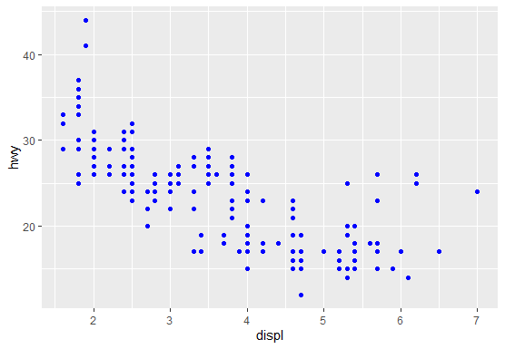

Si introdujésemos ```color = "blue"``` dentro de ```aes()``` se muestra una gráfica sin sentido, pues _ggplot2_ interpreta que no existe ninguna variable llamada _blue_:

```r
ggplot(data = mpg) + 
  geom_point(mapping = aes(x = displ, y = hwy, color = "blue"))
```

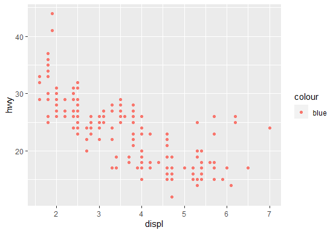

!!! example "Diseña un diagrama de dispersión que represente la cilindrada vs. el gasto en ciudad"
    ??? check "Respuesta"
    
        ```r
        ggplot(data = mpg) + 
            geom_point(mapping = aes(x = displ, y = cty))
        ```
        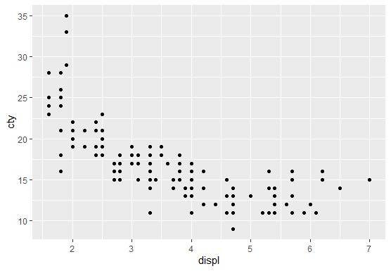
        
!!! example "Sobre la gráfica del ejercicio anterior, cambia la forma de los puntos por cuadrados (```shape = 15```) y representa el tipo de combustible según el color."
    
    ??? check "Respuesta"
    
        ```r
        ggplot(data = mpg) + 
            geom_point(mapping = aes(x = displ, y = cty, color = fl), shape = 15)
        ```
        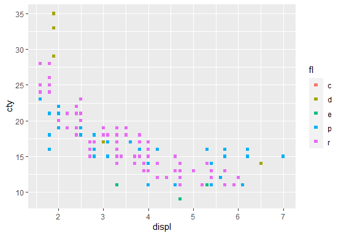
        
        
!!! example "En el ejemplo anterior, ¿cómo modificarías la gráfica de forma que represente aquellos vehiculos con una cilindrada menor que 5 de un color y aquellos con cilindrada mayor de otro?"
    
    ??? hint "Pista:"
    
        Prueba a usar ```color = displ < 5```.
        
    ??? check "Respuesta"
    
        ```r
        ggplot(data = mpg) + 
            geom_point(mapping = aes(x = displ, y = cty, color = displ < 5))
        ```
        
        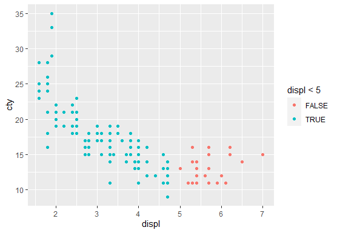

### Gráficos estadísticos

Son **gráficos estadísticos** aquellos que representan datos cuantitativos. Entre ellos encontramos los gráficos de dispersión (ya estudiados), diagramas de barras, diagramas de cajas, histogramas, etc. Para estudiar estos gráficos vamos a usar un nuevo conjunto de datos denominado "_diamonds_", incluido en _ggplot2_, que contiene características estudiadas sobre un gran número de diamantes.

!!! info "Nota"
    Puedes encontrar toda la información sobre este _dataset_ (variables, descripciones, etc.) empleando el comando ```?diamonds```.


Empecemos estudiando los **gráficos de barras**. Para ello, usamos el comando ```geom_bar()```, de la misma forma que con los gráficos de dispersión.

Imaginemos que queremos clasificar los diamantes según la calidad del corte (variable ```cut```). Para ello, usamos:

```r
ggplot(data = diamonds) + 
  geom_bar(mapping = aes(x = cut))
```

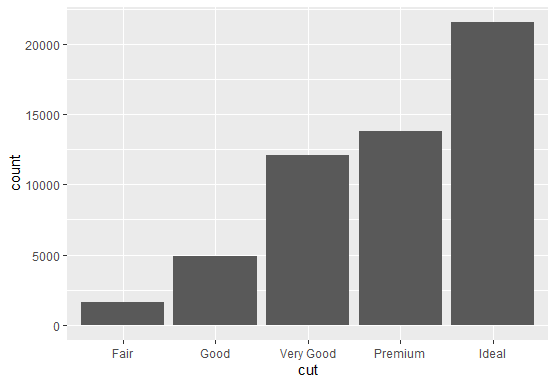

_ggplot2_ interpreta automáticamente que, al no concretar la variable ```y```, debe representar el **número total** de diamantes por calidad de corte. Para ello, _ggplot2_ emplea unas **transformaciones estadisticas** capaces de crear nuevas variables modificando las ya existentes. En este caso, lo que hace es contar el número de diamantes dentro de cada tipo de corte.

!!! info "Nota"
    Si quieres saber más sobre estas transformaciones estadísticas, puedes encontrar más información [aquí](https://r4ds.had.co.nz/data-visualisation.html#statistical-transformations).

Al igual que el resto de gráficas, empleando ```aes()``` puedes modificar a apariencia del gráfico de barras:

- ```color``` cambia el color del borde de las barras
- ```fill``` cambia el color del relleno

Por ejemplo, podemos representar la claridad de los diamantes (variable ```clarity````) de la siguiente forma:

```r
ggplot(data = diamonds) + 
  geom_bar(mapping = aes(x = cut, fill = clarity))
```

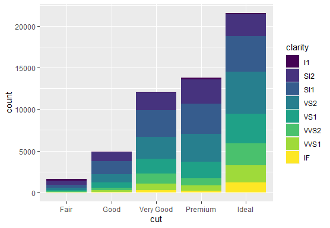

También podemos representar **diagramas de cajas**, empleando la función ```geom_box```. Como ejemplo, podemos representar el gasto en carretera según el tipo de coche de la siguiente manera:

```r
ggplot(data = mpg, mapping = aes(x = class, y = hwy)) + 
  geom_boxplot()
```

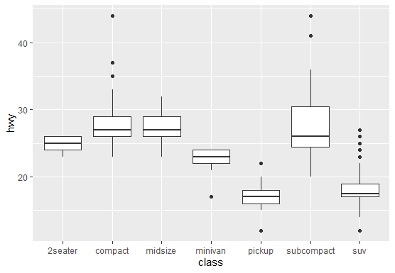

Si necesitamos girar la gráfica, simplemente añadimos ```coord_flip()``` justo a continuación de nuestra gráfica:

```r
ggplot(data = mpg, mapping = aes(x = class, y = hwy)) + 
  geom_boxplot() +
  coord_flip()
```

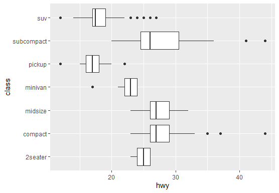


!!! example "Razona:"
    ¿A qué conclusión puedes llegar observando el ejemplo anterior?


## Gráficas múltiples

A veces, para facilitar la visualización de los datos, se intentan representar varias gráficas a la vez. Para ello, existen dos formas: 

- Representar muchas variables dentro de una misma gráfica (*por capas*).
- Dividir los datos en varias ventanas (_*facets*_).

### Gráficas por capas

_ggplot2_ permite representar muchas variables en una misma gráfica de forma sencilla. 

Supongamos que necesitamos representar una linea de tendencia del gasto en carretera con respecto a la cilindrada. Usando ```geom_smooth()``` dibujamos una linea de tendencia suavizada del conjuto de datos propuesto:

```r
ggplot(data = mpg) + 
  geom_smooth(mapping = aes(x = displ, y = hwy))
```
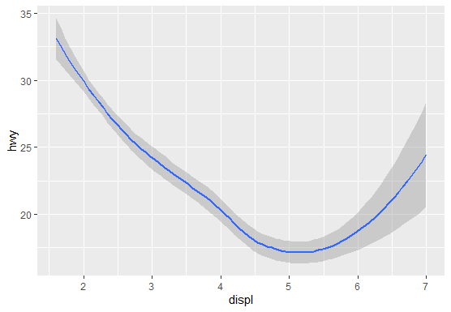


!!! info "Nota"
    Al igual que con el resto de funciones _geom_, ```geom_smooth()``` también posee sus _aesthetics_ específicos (tipo, grosor, color de linea...). Puedes usar ```?geom_smooth``` para ver los que hay disponibles.

Si quisieramos representar esta linea como una capa sobre un diagrama de dispersión, simplemente escribimos sus respectivas funciones _geom_ una después de la otra:

```r
ggplot(data = mpg) + 
  geom_point(mapping = aes(x = displ, y = hwy, color = class)) +
  geom_smooth(mapping = aes(x = displ, y = hwy))
```

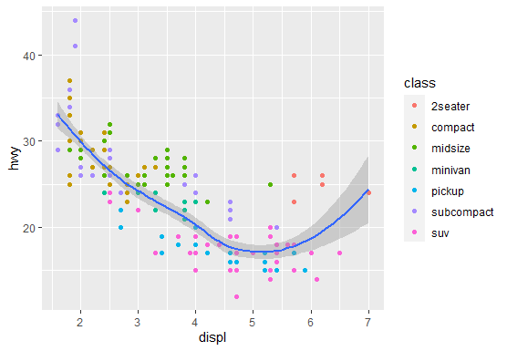

Podemos combinar tantas capas como queramos, siempre y cuando no existan incoherencias entre las variables representadas.

### Gráficas por ventanas (_facets_)

Imaginemos que queremos representar el gasto en carretera con respecto a la cilindrada. Imaginemos también que queremos representar los tipos de vehículos. Podemos hacer como hicimos antes, es decir, representar por colores. Esto, sin embargo, a veces puede resultar en gráficas difíciles de observar, pues es complicado distinguir los diferentes valores.

Para solucionar esto, podemos representar muchas gráficas a la vez, dividiendo las variables en numerosas ventanas. Para ello, usamos ```facet_wrap()```. Se usa de la siguiente forma:

```r
ggplot(data = <DATOS>) + 
  <FUNCIÓN_GEOM>(mapping = aes(<VARIABLES>)) +
  facet_wrap(~ <VARIABLE>, nrow = <NÚMERO DE FILAS>)
```
Representamos el ejemplo anterior:

```r
ggplot(data = mpg) + 
  geom_point(mapping = aes(x = displ, y = hwy)) +
  facet_wrap(~ class, nrow = 2)
```

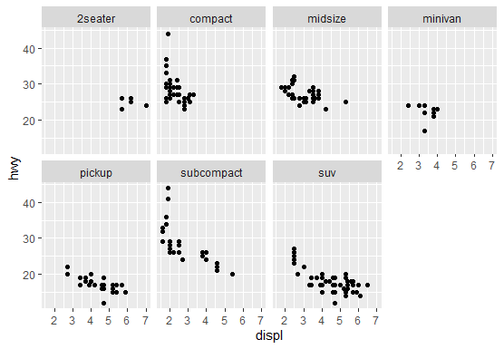

Con _facets_ podemos representar dos variables, empleando la función ```facet_grid()```. Por ejemplo, usemos como variables el tipo de tren de transmision y el número de cilindros:

```r
ggplot(data = mpg) + 
  geom_point(mapping = aes(x = displ, y = hwy)) +
  facet_grid(drv ~ cyl)
```

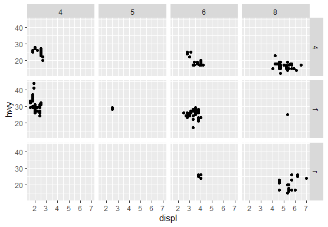

Los _facets_ son muy útiles cuando queremos ver una visión global de todas las posibles representaciones que podemos hacer. Con ella, vemos multitud de gráficas a la vez y podemos seleccionar la que más nos interese.

## Ejercicios de repaso

***MJ: termina proponiendo que cojan otros datos que les digas, y que hagan una gráfica específica. Puedes dar también un fichero Rmd de ejemplo con algo de lo has hecho en este tema.***


!!! cite "Referencias"
    - [***R for Data Science***; Hadley Wickham, Garrett Grolemund et al.](https://r4ds.had.co.nz/)